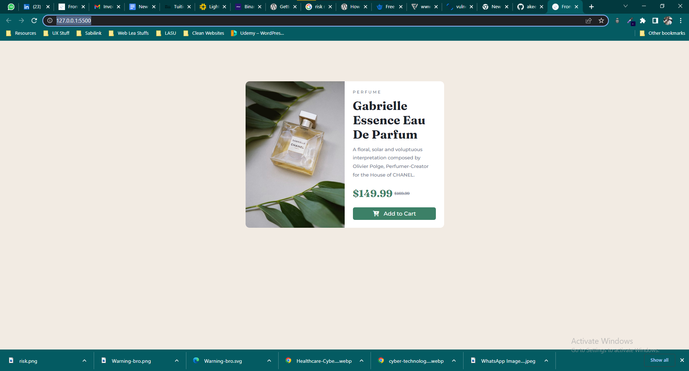

# Frontend Mentor - Product Preview Card Component solution

This is a solution to the [Product Preview Card Component](https://www.frontendmentor.io/challenges/product-preview-card-component-GO7UmttRfa). Frontend Mentor challenges help you improve your coding skills by building realistic projects. 

## Table of contents

- [Overview](#overview)
  - [Screenshot](#screenshot)
  - [Links](#links)
- [My process](#my-process)
  - [Built with](#built-with)
  - [What I learned](#what-i-learned)
  - [Continued development](#continued-development)
- [Author](#author)

## Overview

### Screenshot

### Links

- Solution URL: [Click here to view github solution](https://github.com/akeemolushola/product_component_frontendmentor)
- Live Site URL: [Click here to view live site](https://your-live-site-url.com)

## My process

### Built with

- Semantic HTML5 markup
- CSS properties
- CSS Grid

### What I learned

I used to refresh my memory on some semantic html tags and CSS properties, and in the cause of the project, I did make use of transform properties and media queries that i'm almost forgetting

### Continued development

I will go ahead and practice my flex and grid skils for me to be very convinient with HTML and CSS to create any layout possible

## Author

- Website - [akeemOlushola](https://github.com/akeemolushola)
- Frontend Mentor - [@akeemolushola](https://www.frontendmentor.io/profile/akeemolushola)
- Twitter - [@akeemOlushola2](https://twitter.com/akeemolushola2)

